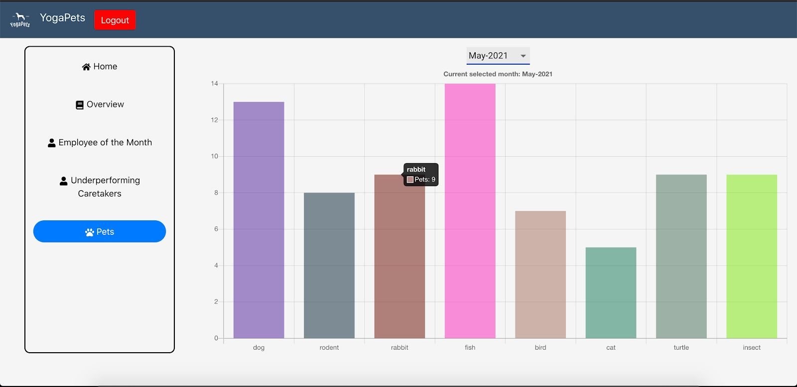
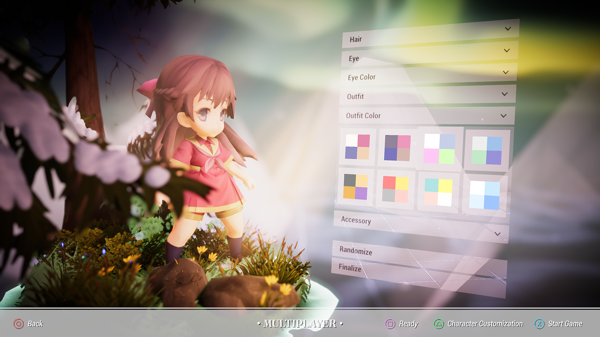
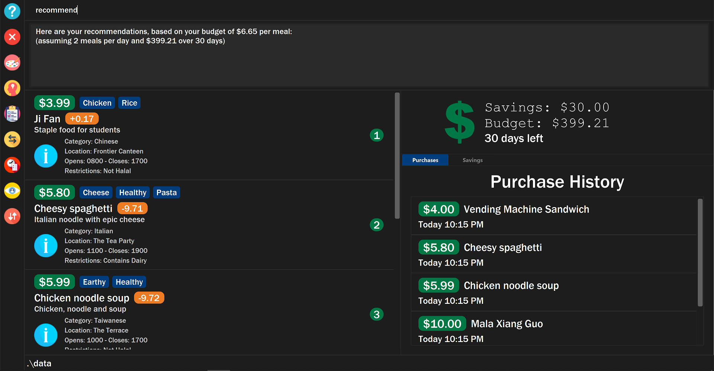
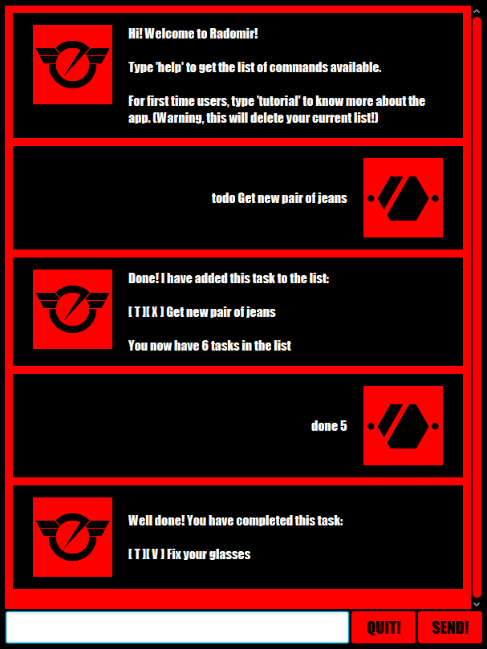

# Roby Tanama

**Co-Founder & CTO @ TrieTech Private Limited | Full-Stack Software Engineer**
📍 Bukit Merah, Singapore

## Contact & Socials
- 📧 Email: tanamaroby@gmail.com
- 💼 LinkedIn: https://www.linkedin.com/in/tanamaroby/
- 🐦 Twitter/X: https://x.com/SCourtest
- 🐙 GitHub: https://github.com/tanamaroby

## Company
**TrieTech Private Limited**
60 Paya Lebar Road, #07-54, Paya Lebar Square, Singapore 409051

---

## About
Hello! I'm Roby Tanama, a dedicated software engineer and co-founder of TrieTech, a forward-thinking software consulting company. An alumnus of the National University of Singapore, my career has been driven by a passion for technology and innovation. At TrieTech, we specialize in crafting bespoke web applications, focusing on delivering both excellence and efficiency. I'm committed to leveraging my expertise to provide top-tier software solutions and fostering growth in the tech industry.

---

## Experience

### Co-Founder & CTO — TrieTech Private Limited
**December 2023 – Present | Singapore**

Link: https://www.trietech.com/

Co-founding and leading a software consulting company specializing in bespoke web application development. Driving technical strategy, architecture decisions, and client delivery — focused on excellence, efficiency, and innovation.

---

### Software Engineer — One X Tech
**June 2022 – September 2023 (1 year 4 months) | Singapore**

Full Stack Software Engineer with broad responsibilities across the development lifecycle:

1. Proficiently used tech stacks: Next.js, React, TypeScript, Node, Supabase, Docusaurus & more.
2. Spearheaded project management; divided projects into sprints & tasks ensuring on-time delivery.
3. Conducted client meetings to understand requirements, set feature goals & align development tasks.
4. Developed a proprietary React component library — used across various client projects to standardize features & improve efficiency.
5. Recognized as the top earner in a company town hall & lauded by peers for extensive stack knowledge & collaborative work ethic.
6. Gained comprehensive experience in end-to-end application development: from requirement inception to final handover.
7. Collaborated with developer teams for sprint planning & code reviews ensuring best practices.
8. Promptly addressed & rectified bugs, added new features to client projects ensuring optimal functionality.
9. Excelled in time management amidst tight deadlines & robust feature requisites.
10. Authored in-depth documentation for the component library detailing each element's purpose, usage & design philosophy.
11. Leveraged JSDoc extensively, enhancing the developer experience for library users.

---

### Software Engineer — GIC
**May 2021 – November 2021 (7 months) | Singapore**

*Details under NDA. Contributed extensively to internal team initiatives and projects.*

---

### Full Stack Engineer — oCap Management
**May 2020 – July 2020 (3 months) | Singapore**

- Created a retrieval-based chatbot to help users with product usage and assist in the onboarding process. Built using the RASA Framework with Python as the primary language.
- Created an OCR program to automatically extract relevant data from documents depending on purpose of usage.
- Helped in reviewing product's UI design and functions.

---

## Education

### National University of Singapore (NUS)
**Bachelor of Computing in Computer Science**

*Specialization: Computer Software Engineering*
2018 – 2022

### Saint Andrew's Junior College
**A Levels — BCME**
*88.75 Rank Points | 5 Distinctions*
2016 – 2017

---

## Projects

*There are more but most are in NDA with clients.*

### Trivial — ERP / Workflow Management Platform
**Late 2023 – Early 2024 | Solo / TrieTech**

**Stack:** Next.js, TypeScript, ShadCN UI, Tailwind CSS, Supabase

A comprehensive ERP and workflow management platform built from the ground up, designed to handle complex business operations through a modular, flow-based architecture.

**Core Features:**
- **Flow Editor:** Visual node-based workflow editor with auto-save, save status indicators, and real-time feedback
- **Module System:** Fully customizable modules with a rich set of field types — text, radio, checkbox, select, running numbers, title/separator, signatures, and table fields
- **Order Management:** Order creation, status tracking, pagination, name editing, and an advanced query builder with search and filtering
- **Inventory System:** Full inventory management with batch support, category tagging, Excel/CSV import with column mapping, formula columns, layout templates, and change logging
- **Notification System:** Real-time push notifications, WhatsApp integration with message previews, notification badges, audio alerts, and read/unread status
- **Department & Authorization:** Profile-based authorization with role support (superuser, admin), multi-department module assignment, and department approval flows
- **Globals Management:** Global variable management with type support, quick-edit, metadata, and detailed change logs
- **Print Mode:** Printable module views with signature support, footer fields, and layout customization
- **Dark Mode:** Full dark mode support with custom theming and color schemes

**Development Highlights:**
- Grew from v0.5.0 to v0.9.3 across ~6 months of active development
- Implemented server-side caching, parallel data fetching, and performance optimizations throughout
- First-hand experience building a production-grade ERP system end-to-end, from schema design to complex UI flows

---

### Pet-caring Platform — YogaPets
**Sep 2020 – Nov 2020 | Associated with National University of Singapore**

Online pet caring platform for both pet owners and caretakers. Pet owners are able to register their pets and search and bid for caretakers to look after them. Caretakers can find employment through the website by working as either a full-time or part-time caretaker, with automated salary calculation built in.

This project was part of a database module requirement, built in a team of 5. A significant challenge as it was the first time working on an extensive database system. Built as a full-stack application.

---

### Multiplayer Platformer — Aether
**Jan 2020 – May 2020**

A Unity platformer game with a unique twist: players can only see areas they have already explored. Players work together in a team of 4 to traverse through levels filled with challenging monsters and tricky platforming sections. Powerups and spells are scattered throughout the level to assist players in reaching the end.

First official Unity game development project. Most development time was spent learning how to implement new mechanics. Despite the challenges, it was fulfilling to complete the game after months of hard work. **Won 1st Place at NUS CS3247 STePS 2020.**

---

### Budget Management App — SaveNUS
**Sep 2019 – Nov 2019 | Associated with National University of Singapore**

An app designed to help users manage their budget when it comes to meals. Takes in the user's current budget and plans meals according to desired timing and budget specified. Also includes an algorithm to ensure meals are not too repetitive.

First software engineering team project — many lessons learned about collaborative development. Fully coded in **Java** with **JavaFX** for the GUI. First experience with CI/CD pipelines, pull request workflows, and pair programming.

---

### Task Manager Bot — Radomir
**Aug 2019 – Sep 2019 | Associated with National University of Singapore**

A Java CLI-based chatbot designed to assist users with managing their tasks and deadlines. Fully coded in **Java** with a **JavaFX** GUI.

First ever software engineering project and first experience with software development, testing, and deployment end-to-end.

---

## Skills

### Frontend Development
- **Frameworks & Libraries:** React, Next.js, ShadCN UI, Tailwind CSS
- **Languages:** TypeScript, JavaScript (ES6+), HTML5, CSS3
- **Patterns & Practices:** Component-driven architecture, Server-side rendering (SSR), Static site generation (SSG), Responsive UI design
- **Documentation & Dev Tools:** JSDoc, Docusaurus, ESLint, Prettier

### Backend Development
- **Frameworks:** Node.js, Flask (Python)
- **Languages:** TypeScript, JavaScript, Python, Java
- **API Design:** RESTful APIs, API integration, Third-party service integration
- **Authentication & Security:** Row-Level Security (RLS), Auth middleware, JWT

### Systems & Low-Level Programming
- **Languages:** C++
- **Areas:** Systems programming, Memory management, CLI application development, Algorithm design & data structures

### Database & Data
- **Databases:** PostgreSQL, Supabase
- **Practices:** Database schema design, Query optimization, RLS policy implementation, Data warehousing, ETL pipelines
- **Tools:** Databricks (data platform & transformation pipelines)

### DevOps & Infrastructure
- **Containerization:** Docker, Docker Compose
- **Platforms:** Linux, macOS
- **CI/CD:** GitHub Actions, CI/CD pipeline setup & management
- **Deployment:** Vercel, Heroku, Google App Engine

### Full-Stack Ecosystem
- **BaaS:** Supabase (Auth, Database, Storage, Edge Functions)
- **Version Control:** Git, GitHub, Pull request workflows, Code review
- **Project Management:** Sprint planning, Task breakdown, On-time delivery

### Professional Skills
- Software consulting & client management
- End-to-end application development
- Requirements gathering & feature scoping
- Technical documentation & developer experience (DX)
- Team collaboration, pair programming & mentoring
- Time management under tight deadlines

---

## Licenses & Certifications

All issued by **University of Pennsylvania** via Coursera, **June 2024**:

| Course | Credential ID | Link |
|--------|--------------|------|
| Entrepreneurship 1: Developing the Opportunity | `D2EV25277CTC` | [Show Credential](https://www.coursera.org/account/accomplishments/records/D2EV25277CTC) |
| Entrepreneurship 2: Launching your Start-Up | `ASEKDK24YGBP` | [Show Credential](https://www.coursera.org/account/accomplishments/records/ASEKDK24YGBP) |
| Entrepreneurship 3: Growth Strategies | `D47QTE7AQR69` | [Show Credential](https://www.coursera.org/account/accomplishments/records/D47QTE7AQR69) |
| Entrepreneurship 4: Financing and Profitability | `83YG695XGFCD` | [Show Credential](https://www.coursera.org/account/accomplishments/records/83YG695XGFCD) |

---

## Languages

| Language   | Proficiency             |
|------------|-------------------------|
| Indonesian | Native or Bilingual     |
| English    | Native or Bilingual     |
| Chinese    | Elementary              |
| Japanese   | Elementary              |

---

## Honors & Awards

### 🥇 NUS CS3247 STePS 2020 — 1st Place
**May 2020**
My team of 6 people working on a multiplayer platformer game, *Aether*, won 1st place in the NUS Game Development event. This was a Unity project that took about 2+ months in development.

### 🏆 Hack&Roll 2019 — Best Freshman Hack
**January 2019**
My team won the Best Freshman Hack by creating a visual novel with an intricate story and multiple endings. This work tested our knowledge and application of Python as well as the creative aspect of Computer Science.
